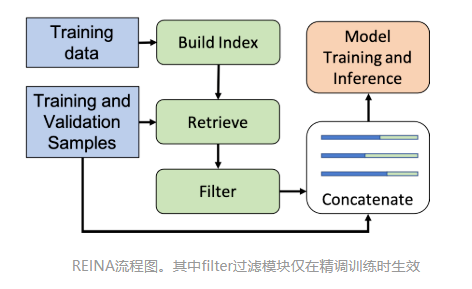

# 【关于 REINA】 那些的你不知道的事

> 作者：杨夕
> 
> 项目地址：https://github.com/km1994/nlp_paper_study
> 
> NLP 面经地址：https://github.com/km1994/NLP-Interview-Notes
> 
> 个人介绍：大佬们好，我叫杨夕，该项目主要是本人在研读顶会论文和复现经典论文过程中，所见、所思、所想、所闻，可能存在一些理解错误，希望大佬们多多指正。
> 
> 论文：Training Data is More Valuable than You Think: A Simple and Effective Method by Retrieving from Training Data
> 
> 发表会议：ACL 2022
> 
> 论文地址：https://www.microsoft.com/en-us/research/publication/training-data-is-more-valuable-than-you-think-a-simple-and-effective-method-by-retrieving-from-training-data/
> 
> github：https://github.com/microsoft/REINA

## 一、摘要

Retrieval-based methods have been shown to be effective in NLP tasks via introducing external knowledge. However, the indexing and retrieving of large-scale corpora bring considerable computational cost. Surprisingly, we found that REtrieving from the traINing datA (REINA) only can lead to significant gains on multiple NLG and NLU tasks. We retrieve the labeled training instances most similar to the input text and then concatenate them with the input to feed into the model to generate the output. Experimental results show that this simple method can achieve significantly better performance on a variety of NLU and NLG tasks, including summarization, machine translation, language modeling, and question answering tasks. For instance, our proposed method achieved state-of-the-art results on XSum, BigPatent, and CommonsenseQA.

- 动机：通过引入外部知识，基于检索的方法已被证明在 NLP 任务中是有效的。然而，大规模语料库的索引和检索带来了相当大的计算成本。
- 论文方法：发现从训练数据 (REINA) 中检索只能导致多项 NLG 和 NLU 任务的显着收益。检索与输入文本最相似的标记训练实例，然后将它们与输入连接起来以馈入模型以生成输出。
- 实验结果表明，这种简单的方法可以在各种 NLU 和 NLG 任务上取得明显更好的性能，包括摘要、机器翻译、语言建模和问答任务。例如，我们提出的方法在 XSum、BigPatent 和 CommonsenseQA 上取得了最先进的结果。

## 二、论文动机

- 通过引入外部知识，基于检索的方法已被证明在 NLP 任务中是有效的。然而，大规模语料库的索引和检索带来了相当大的计算成本。

## 三、论文方法

1. 先把训练集构建为[key,value]的形式、其中key、value分别为原任务的输入输出；
2. 之后，对于每个新的输入 x ,REINA会去[key,value]集合里面检索和 x 最相似的K个key，并把其对应的value 与输入 x 做拼接，构造新的输入值(比如 [x1,v1,...,vK] )来精调训练模型、或者做测试推理。注意做精调训练时，需要在检索到的top K value集中过滤掉真实值(即训练输入 x 对应的Ground Truth)。

## 四、实验结果

## 五、总结

## 参考资料

1. [RelationPrompt：通过提示语言模型的数据生成来解决零样本关系三元组抽取任务](https://zhuanlan.zhihu.com/p/490792345)